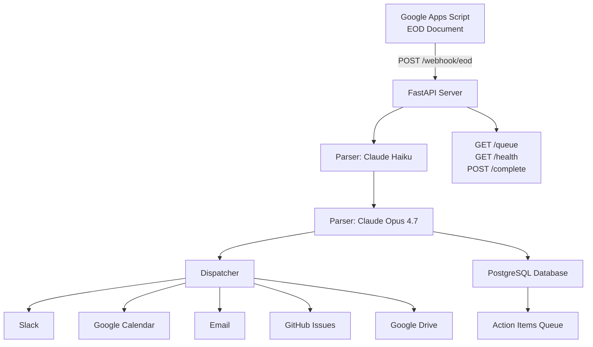
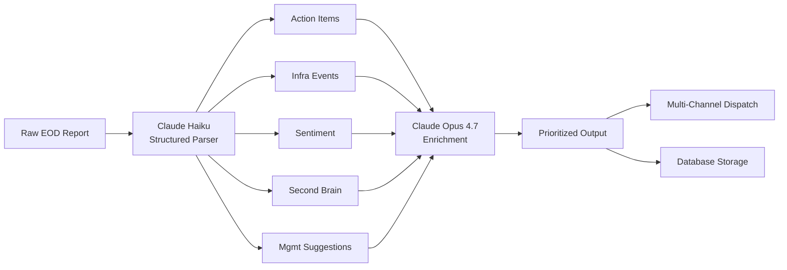

# System Architecture

## High-Level Flow



## Data Pipeline (5 Layers)



## Component Breakdown

### 1. Entry Point: `main.py`

**Responsibilities:**
- FastAPI application initialization
- Lifespan management (startup/shutdown)
- Database connection pool with retry logic
- 4 REST endpoints (webhook, queue, complete, health)
- Error handling and response formatting

**Key Functions:**
```python
async def lifespan(app):           # DB pool + parser init
async def init_schema():           # PostgreSQL table creation
async def process_eod(payload):   # Main webhook handler
async def get_queue():             # Fetch pending items
async def complete_item(id):      # Mark item done
async def health_check():          # System status
```

**Database Schema:**
- `eod_reports`: Full parsed + enriched JSON
- `action_items`: Task queue with status tracking

---

### 2. Parsing Engine: `parser.py`

**Dual-Claude Strategy:**

```
┌────────────────────────────────────────────────────────────┐
│ Claude Haiku 4 - Fast Structured Extraction               │
│                                                            │
│ Input:  Raw EOD markdown/text (2-10K words)               │
│ Prompt: Strict JSON schema enforcement                    │
│ Output: 5 data layers in valid JSON                       │
│ Speed:  ~2 seconds                                         │
│ Cost:   ~$0.002 per report                                 │
└────────────────────────────────────────────────────────────┘
                            ↓
┌────────────────────────────────────────────────────────────┐
│ Claude Opus 4.7 - Deep Context Enrichment                 │
│                                                            │
│ Input:  Haiku's parsed JSON                               │
│ Prompt: Prioritize, add context, detect patterns          │
│ Output: Enrichment object with adjustments                │
│ Speed:  ~5 seconds                                         │
│ Cost:   ~$0.18 per report                                  │
└────────────────────────────────────────────────────────────┘
```

**Why Two Models?**
- **Haiku**: JSON schema adherence, cost-effective extraction
- **Opus**: Nuanced reasoning, priority re-ranking, pattern detection
- **Combined**: Speed of Haiku + intelligence of Opus

**System Prompts:**
- Haiku: Extract 5 layers with strict JSON validity
- Opus: Enrich context, adjust priorities, identify escalations

---

### 3. Data Models: `models.py`

**15 Pydantic Models** for end-to-end type safety:

**Input Models:**
- `EODWebhookPayload` - Google Apps Script request

**5 EOD Layer Models:**
- `ActionItem` - Owner, priority (P0-P4), due, channels
- `InfraEvent` - Service, error, severity, GitHub flag
- `Sentiment` - Tone, patterns, compliance flags
- `SecondBrainEntry` - Type (decision/command/note), content, tags
- `ManagementSuggestion` - Type (doc/diagram/share), content, destination

**Aggregate Models:**
- `ParsedEOD` - All 5 layers combined
- `EnrichedEOD` - Parsed + Opus enrichment/prioritization

**Database Models:**
- `StoredEOD` - Persisted report with timestamps
- `ActionItemStatus` - Queue item with status lifecycle

**Response Models:**
- `WebhookResponse`, `QueueResponse`, `CompleteResponse`

**Type Safety:**
- Literal types for enums (`priority: Literal["P0", "P1", ...]`)
- Required vs optional fields
- Nested model validation

---

### 4. Dispatcher: `dispatcher.py`

**Multi-Channel Routing Logic:**

```python
class Dispatcher:
    async def dispatch_action_items(items):
        for item in items:
            for channel in item.channels:
                if channel == "slack":    → _send_to_slack()
                if channel == "calendar": → _add_to_calendar()
                if channel == "email":    → _send_email()
    
    async def create_github_issue(event):  # If event.github_issue
    async def create_drive_doc(suggestion): # For diagrams/docs
```

**Current Status: Stubs with TODO Markers**

Each method includes:
- Exact API documentation link
- Required environment variables
- Code skeleton with payload examples
- Error handling guidance

**Implementation Priority:**
1. Slack (highest value) - Rich message blocks
2. GitHub (automate incidents) - Auto-issue creation
3. Calendar (scheduling) - Task auto-scheduling
4. Email (stakeholders) - External notifications
5. Drive (artifacts) - Doc/diagram generation

---

### 5. Infrastructure: Docker + Deployment

**Dockerfile Strategy:**

```dockerfile
# Multi-stage build
FROM python:3.11-slim AS base
  → Install system deps (gcc, postgresql-client)
  → Copy requirements.txt, install Python deps

FROM base AS production
  → Create non-root user (security)
  → Copy application code
  → HEALTHCHECK endpoint
  → CMD: uvicorn with 2 workers
```

**Production Features:**
- Non-root user (UID 1000)
- Health check (30s interval)
- Minimal attack surface (slim base image)
- Explicit port exposure (8000)

**Railway Deployment:**
- Auto-detects Dockerfile
- Injects env vars (`ANTHROPIC_API_KEY`, `DATABASE_URL`)
- Provides public HTTPS URL
- Scales to 0 when idle (free tier)

---

## Request Flow: EOD Report Processing

```
1. Google Apps Script detects doc edit
   └─→ Triggers onEdit() function

2. Apps Script POSTs to /webhook/eod
   └─→ Payload: {doc_id, content, folder_id, timestamp}

3. FastAPI receives request
   └─→ Validates payload against EODWebhookPayload model

4. Parser: Claude Haiku extraction
   └─→ System prompt: "Extract 5 layers, strict JSON"
   └─→ Returns: ParsedEOD model with all layers

5. Parser: Claude Opus enrichment
   └─→ Input: Haiku's parsed JSON
   └─→ Output: Context additions, priority adjustments, escalations

6. Dispatcher: Multi-channel routing (best-effort)
   ├─→ Action items → Slack/Calendar/Email (by channel config)
   ├─→ Infra events (if github_issue=true) → GitHub Issues
   └─→ Management suggestions → Google Drive

7. Database: Persist results
   ├─→ INSERT into eod_reports (full parsed + enriched JSON)
   └─→ INSERT into action_items (one row per action item)

8. Response: Return JSON
   └─→ {success, eod_id, parsed, enriched}

9. Apps Script logs response
   └─→ Logger.log() for debugging
```

**Error Handling:**
- Invalid JSON from Haiku → 400 Bad Request
- Opus enrichment fails → Return parsed data without enrichment
- Dispatcher errors → Log warning, continue (best-effort)
- Database unavailable → Log warning, return success without persistence
- General errors → 500 Internal Server Error with details

---

## Database Design

### Schema

```sql
-- EOD Reports (source of truth)
CREATE TABLE eod_reports (
    id SERIAL PRIMARY KEY,
    doc_id VARCHAR(255) NOT NULL,       -- Google Doc ID
    folder_id VARCHAR(255) NOT NULL,    -- Drive folder
    timestamp TIMESTAMPTZ NOT NULL,     -- Report timestamp
    parsed_data JSONB NOT NULL,         -- Haiku output
    enriched_data JSONB,                -- Opus output
    created_at TIMESTAMPTZ DEFAULT NOW()
);

-- Action Items Queue
CREATE TABLE action_items (
    id SERIAL PRIMARY KEY,
    eod_id INTEGER REFERENCES eod_reports(id),
    title TEXT NOT NULL,
    owner VARCHAR(255) NOT NULL,
    priority VARCHAR(10) NOT NULL,      -- P0, P1, P2, P3, P4
    due VARCHAR(255),
    channels JSONB NOT NULL,            -- ["slack", "calendar"]
    status VARCHAR(50) DEFAULT 'pending', -- pending/in_progress/completed
    completed_at TIMESTAMPTZ,
    created_at TIMESTAMPTZ DEFAULT NOW()
);

-- Indexes for performance
CREATE INDEX idx_action_items_status ON action_items(status);
CREATE INDEX idx_eod_reports_timestamp ON eod_reports(timestamp);
```

### Data Retention
- Keep EOD reports indefinitely (historical reference)
- Archive completed action items after 90 days
- Sentiment analysis for trend detection over time

---

## Security Considerations

### Current State
- ⚠️ **No webhook authentication** - Any caller can POST to `/webhook/eod`
- ⚠️ **No rate limiting** - Susceptible to quota exhaustion
- ⚠️ **No request size limits** - Large payloads could DoS the server

### Production Hardening (TODO)
```python
# 1. HMAC Signature Verification
def verify_webhook_signature(payload, signature, secret):
    expected = hmac.new(secret.encode(), payload, hashlib.sha256).hexdigest()
    return hmac.compare_digest(expected, signature)

# 2. Rate Limiting (slowapi)
from slowapi import Limiter
limiter = Limiter(key_func=get_remote_address)
@app.post("/webhook/eod")
@limiter.limit("10/minute")
async def process_eod(...):

# 3. Request Size Limits (FastAPI)
app.add_middleware(RequestSizeLimitMiddleware, max_size=1_000_000)  # 1MB

# 4. Input Sanitization
# Already handled by Pydantic validation on EODWebhookPayload
```

---

## Monitoring & Observability

### Metrics to Track

**Application:**
- Parse success rate (Haiku JSON validity)
- Enrichment latency (Opus response time)
- Dispatch success rate per channel
- Database connection health
- Queue depth (pending action items)

**Infrastructure:**
- Railway dyno uptime
- Memory usage (PostgreSQL connection pool)
- API quota consumption (Anthropic)
- Error rate by endpoint

### Logging Strategy

```python
# Structured logging (JSON for Railway/DataDog)
import logging
import json

logger = logging.getLogger(__name__)

# Example log entry
logger.info(json.dumps({
    "event": "eod_processed",
    "eod_id": 42,
    "doc_id": "1abc...",
    "action_items": 3,
    "parse_time_ms": 2150,
    "enrich_time_ms": 5230,
    "channels_dispatched": ["slack", "calendar"]
}))
```

### Recommended Tools
- **Railway Logs:** Built-in, real-time streaming
- **Sentry:** Error tracking with stack traces
- **DataDog/New Relic:** APM for latency monitoring
- **Anthropic Dashboard:** API usage and costs

---

## Scalability

### Current Capacity (Railway Free Tier)
- **Instance:** 512MB RAM, 1 vCPU
- **Throughput:** ~50 EOD reports/hour
- **Bottleneck:** Sequential Claude API calls (7-8s per report)

### Optimization Strategies

**Phase 1: Parallel Processing**
```python
# Process multiple EOD reports concurrently
import asyncio

async def process_batch(payloads):
    tasks = [process_eod(p) for p in payloads]
    results = await asyncio.gather(*tasks)
    return results
```

**Phase 2: Background Jobs**
```python
# Use Celery or Railway background workers
from celery import Celery

@celery.task
def enrich_eod(eod_id):
    # Deferred Opus enrichment for lower latency
    parsed = fetch_eod(eod_id)
    enriched = parser.enrich_with_opus(parsed)
    update_eod(eod_id, enriched)
```

**Phase 3: Horizontal Scaling**
- Railway: Scale to multiple instances with load balancer
- Database: Read replicas for `/queue` endpoint
- Caching: Redis for frequently accessed action items

---

## Future Enhancements

### 1. Second Brain Semantic Search
```python
# Add pgvector extension to PostgreSQL
CREATE EXTENSION vector;

ALTER TABLE second_brain_entries
ADD COLUMN embedding vector(1536);  # OpenAI ada-002

# Semantic search
SELECT content, tags
FROM second_brain_entries
ORDER BY embedding <-> query_embedding
LIMIT 10;
```

### 2. Real-Time Dashboard
- WebSocket endpoint for live queue updates
- Next.js frontend with Tailwind UI
- Drag-and-drop kanban board
- Push notifications for P0 items

### 3. Workflow Automation
- Auto-complete action items via integration callbacks
- Slack slash commands (`/complete-task 42`)
- Calendar event completion triggers

### 4. Analytics Dashboard
- Sentiment trend lines (team health over time)
- Priority distribution charts (P0 vs P4 ratio)
- Time-to-completion metrics per owner
- Compliance violation tracking

---

## File Dependencies

```
main.py
├── models.py (all Pydantic models)
├── parser.py (Claude integration)
│   └── models.py (ParsedEOD, EnrichedEOD)
└── dispatcher.py (channel routing)
    └── models.py (ActionItem, InfraEvent, etc.)

requirements.txt
├── fastapi==0.115.0
├── uvicorn==0.32.0
├── anthropic==0.39.0
├── pydantic==2.9.2
├── psycopg2-binary==2.9.9
├── sqlalchemy==2.0.35
└── asyncpg==0.30.0
```

**No circular dependencies.** Clean separation of concerns.

---

## Testing Strategy

### Unit Tests (TODO)
```python
# tests/test_parser.py
def test_haiku_extraction():
    parser = EODParser(api_key="test")
    result = await parser.parse_with_haiku(sample_eod)
    assert len(result.action_items) > 0

# tests/test_dispatcher.py
@pytest.mark.asyncio
async def test_slack_dispatch():
    dispatcher = Dispatcher()
    item = ActionItem(title="Test", owner="alice", ...)
    await dispatcher._send_to_slack(item)  # Mock httpx
```

### Integration Tests
```bash
# Test full webhook flow
curl -X POST http://localhost:8000/webhook/eod \
  -H "Content-Type: application/json" \
  -d @tests/fixtures/sample_eod.json

# Verify database persistence
psql $DATABASE_URL -c "SELECT COUNT(*) FROM eod_reports;"
```

### Load Testing
```bash
# Use k6 or wrk for load testing
k6 run tests/load_test.js
  # Target: 100 req/min sustained
  # Expected: <10s p95 latency
```

---

**Summary:** This architecture is production-ready for the core parsing pipeline. Dispatcher integrations and frontend dashboard are the next milestones.

See `DEPLOYMENT.md` for step-by-step deployment instructions.
